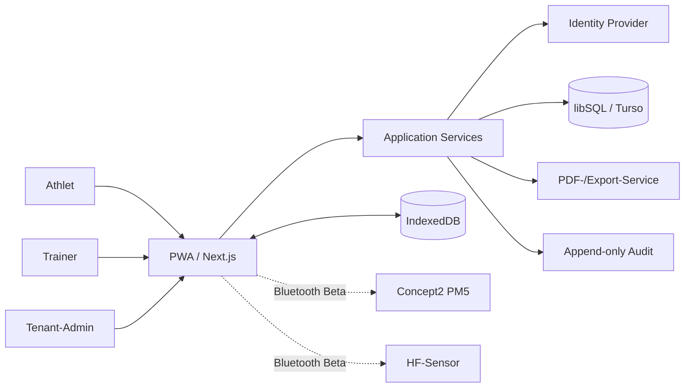

# ARCHITECTURE.md

## 1. Architekturziele

Die Architektur muss denselben Fachkern in zwei Betriebsformen tragen:

1. **SaaS:** mehrere logisch isolierte Tenants, Clerk und Turso Cloud.
2. **Club:** exakt ein Tenant, Better Auth und lokaler libSQL-Server ohne externe Pflichtdienste.

Fachlogik, Datenmodell, Migrationen und Benutzeroberflächen bleiben identisch. Unterschiede werden ausschließlich über Provider und Deployment-Konfiguration gekapselt.

## 2. Systemkontext



## 3. Schichten

### Präsentation

- Next.js App Router
- serverseitige Seiten für Dashboards und Verwaltung
- Client-Komponenten nur für Timer, PWA, IndexedDB, Bluetooth und interaktive Diagramme
- barrierearme Komponenten, Tablet-Priorität

### Application Services

Orchestrieren Anwendungsfälle, Transaktionen, Autorisierung und Auditierung. Beispiele:

- `PlanTest`
- `StartTest`
- `PersistOfflineStage`
- `ReviewMeasurements`
- `RunThresholdModels`
- `ReleaseReport`
- `ExportTenant`

### Domain

Framework-unabhängige Regeln:

- Testzustandsmaschine
- Rollen- und Berechtigungsmatrix
- Teilstufenregel
- Vergleichbarkeitsklassifikation
- Freigabekriterien
- Schwellen- und Zonenmodelle

### Infrastruktur

- Drizzle/libSQL
- Better Auth oder Clerk
- Dexie/IndexedDB
- Web Bluetooth Adapter
- PDF-/Export-Adapter
- Backup-/Update-Adapter

## 4. Modulgrenzen

| Modul | Verantwortung |
|---|---|
| `identity` | Anmeldung, Session und Provider-Zuordnung |
| `tenancy` | Tenant-Kontext, Rollen und Isolation |
| `athletes` | Stammdaten, Snapshots, Trainerzuordnung |
| `consents` | Einwilligungen, Minderjährige, Widerruf |
| `protocols` | Vorlagen, Versionen, Testplanung aus LT2 |
| `tests` | Lebenszyklus, Timer, Stufen, Locks |
| `quality` | Warnungen, Korrekturen, Ausschlüsse |
| `diagnostics` | vier Modelle, Trainerentscheidung, Zonen |
| `reports` | unveränderliche Berichtsversionen |
| `exports` | PDF, CSV, JSON, Markdown, Portabilität |
| `audit` | append-only Ereignisse |
| `sync` | idempotente Offline-Synchronisation |
| `bluetooth` | HR, PM5 und experimenteller RP3-Adapter |

## 5. Autorisierung

Jeder fachliche Schreibvorgang folgt derselben Pipeline:

1. Session über `IdentityProvider` auflösen.
2. Tenant aus der autorisierten Membership ableiten; nie aus Clientdaten übernehmen.
3. Aktion anhand Rolle, Athletenzuordnung und Teststatus prüfen.
4. Mutation in einer Datenbanktransaktion ausführen.
5. Audit-Ereignis in derselben Transaktion anhängen.
6. Ergebnis ohne fremde Tenant-Daten zurückgeben.

## 6. Datenhaltung

- Alle fachlichen Tabellen tragen `tenant_id`.
- IDs sind UUID/ULID-Strings; fachliche Export-IDs sind getrennt von technischen IDs.
- Freigaben und Interpretationen sind versioniert und nach Freigabe unveränderlich.
- SQLite-kompatible Typen; Zeitpunkte als ISO-8601 UTC-Strings.
- Dezimalwerte werden für den MVP als ganzzahlige Skalenwerte gespeichert, wo Rundungsfehler kritisch sind:
  - Laktat: `millimoles_x100`
  - Gewicht: `kilograms_x100`
  - Leistung: Watt als Integer

## 7. Offline-Synchronisation

Der Browser persistiert einen laufenden Test nach jeder Mutation in IndexedDB. Jede Mutation besitzt:

- `operation_id` (global eindeutig)
- `test_id`
- `entity_id`
- `expected_version`
- `occurred_at`
- Payload und Schema-Version

Der Server führt eine Operation höchstens einmal aus. Bei Versionskonflikten erfolgt keine automatische Überschreibung; die UI zeigt beide Stände.

## 8. Auth-Provider

```ts
export interface IdentityProvider {
  getSession(): Promise<IdentitySession | null>;
  inviteUser(input: InviteUserInput): Promise<InviteResult>;
  revokeSession(sessionId: string): Promise<void>;
}
```

- `BetterAuthIdentityProvider`: verbindlich im autarken Modus
- `ClerkIdentityProvider`: bevorzugt im SaaS-Modus

Die fachliche Rolle ist niemals ausschließlich in Provider-Metadaten gespeichert.

## 9. Diagnostischer Fachkern

`packages/diagnostics` darf weder React, Next.js noch Datenbankcode importieren. Jeder Lauf speichert:

- Algorithmusname und Version
- Eingabepunkte und Ausschlüsse
- Koeffizienten
- Ergebnis und Warnungen
- deterministischen Input-Hash

Modelle:

1. fixe 2-/4-mmol-Schwellen, lineare Interpolation
2. Basislaktat + 1,0 mmol/l, lineare Interpolation
3. Dmax, kubisches Polynom
4. modifiziertes Dmax, kubisches Polynom

Die genaue modifizierte-Dmax-Definition wird vor Implementierung in ADR-0006 und mit Referenzliteratur fixiert.

## 10. Deployment

### Club-Modus

```text
Caddy -> Next.js -> libSQL
                -> persistentes Volume
Backup-Job -> verschlüsseltes Ziel/NAS
```

### SaaS-Modus

```text
Reverse Proxy/Platform -> Next.js -> Turso Cloud
                         Next.js -> Clerk
```

Keine Anwendungskomponente darf zwingend CDN, Telemetrie oder externen Mailversand benötigen.

## 11. Architekturentscheidungen

Siehe [`docs/adr`](./docs/adr). Offene Entscheidungen werden vor der jeweiligen Implementierungsphase als ADR geschlossen.
