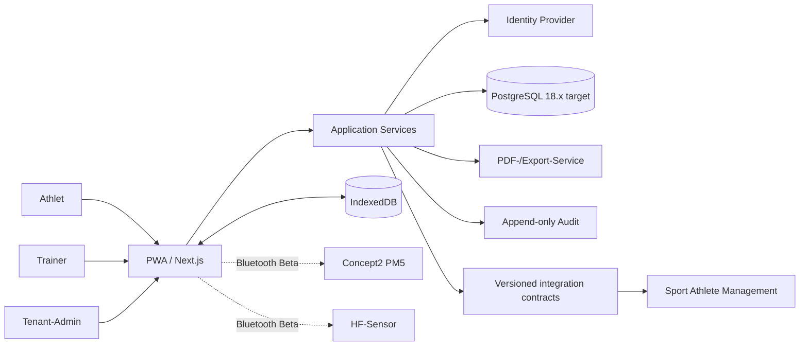

# ARCHITECTURE.md

## 1. Architekturziele

Die Architektur muss denselben diagnostischen Fachkern in zwei Betriebsformen tragen und auf die gemeinsame Plattformarchitektur konvergieren:

1. **SaaS:** mehrere logisch isolierte Tenants; serverseitige Persistenz auf PostgreSQL 18.x im privaten Plattformnetz.
2. **Club:** exakt ein Tenant; Better Auth und langfristig ein lokaler PostgreSQL-18.x-Container ohne externe Pflichtdienste.

PostgreSQL 18.x ist der verbindliche Zielprovider. Die initiale Produktionsbasis ist PostgreSQL 18.6; Patch-Releases innerhalb Major 18 können nach Backup-/Restore-Prüfung nachgezogen werden. Der bestehende libSQL-Provider bleibt ausschließlich als Übergangsprovider produktiv zulässig, bis die in ADR-0023 definierten Migrations- und Requalifikations-Gates bestanden sind.

Fachlogik, Testzustandsmaschine, Diagnostikalgorithmen, Offline-Vertrag, Datenschutzregeln und Benutzeroberflächen dürfen durch den Providerwechsel nicht semantisch verändert werden. Provider- und Deployment-Unterschiede bleiben an Infrastrukturgrenzen gekapselt.

## 2. Systemkontext



Im Übergang darf die Serverpersistenz weiterhin libSQL verwenden. Dieser Übergang ändert weder den Offline-Vertrag noch die fachlichen Grenzen.

## 3. Schichten

### Präsentation

- Next.js App Router
- serverseitige Seiten für Dashboards und Verwaltung
- Client-Komponenten nur für Timer, PWA, IndexedDB, Bluetooth und interaktive Diagramme
- barrierearme Komponenten, Tablet-Priorität

### Application Services

Orchestrieren Anwendungsfälle, Transaktionen, Autorisierung und Auditierung. Beispiele:

- `PlanTest`
- `StartTest`
- `PersistOfflineStage`
- `ReviewMeasurements`
- `RunThresholdModels`
- `ReleaseReport`
- `ExportTenant`
- `PublishReleasedDiagnosticArtifact`

### Domain

Framework-unabhängige Regeln:

- Testzustandsmaschine
- Rollen- und Berechtigungsmatrix
- Teilstufenregel
- Vergleichbarkeitsklassifikation
- Freigabekriterien
- Schwellen- und Zonenmodelle

### Infrastruktur

- Drizzle ORM
- PostgreSQL 18.x als Zielprovider
- libSQL als zeitlich begrenzter Übergangsprovider bis zum bestandenen Migrations-Gate
- Better Auth oder konfigurierter SaaS-Identity-Provider
- Dexie/IndexedDB
- Web Bluetooth Adapter
- PDF-/Export-Adapter
- Backup-/Update-Adapter
- versionierte API-/Event-Adapter für Produktintegration

## 4. Modulgrenzen

| Modul | Verantwortung |
|---|---|
| `identity` | Anmeldung, Session und Provider-Zuordnung |
| `tenancy` | Tenant-Kontext, Rollen und Isolation |
| `athletes` | Stammdaten, Snapshots, Trainerzuordnung und externe Identitäts-Mappings |
| `consents` | Einwilligungen, Minderjährige, Widerruf |
| `protocols` | Vorlagen, Versionen, Testplanung aus LT2 |
| `tests` | Lebenszyklus, Timer, Stufen, Locks |
| `quality` | Warnungen, Korrekturen, Ausschlüsse |
| `diagnostics` | vier Modelle, Trainerentscheidung, Zonen |
| `reports` | unveränderliche Berichtsversionen |
| `exports` | PDF, CSV, JSON, Markdown, Portabilität |
| `audit` | append-only Ereignisse |
| `sync` | idempotente Offline-Synchronisation |
| `integration` | versionierte, freigegebene Diagnostic Artifacts und Outbox-Ereignisse |
| `bluetooth` | HR, PM5 und experimenteller RP3-Adapter |

## 5. Autorisierung

Jeder fachliche Schreibvorgang folgt derselben Pipeline:

1. Session über `IdentityProvider` auflösen.
2. Tenant aus der autorisierten Membership ableiten; nie aus Clientdaten übernehmen.
3. Aktion anhand Rolle, Athletenzuordnung und Teststatus prüfen.
4. Mutation in einer Datenbanktransaktion ausführen.
5. Audit-Ereignis in derselben Transaktion anhängen.
6. Ergebnis ohne fremde Tenant-Daten zurückgeben.

Produktübergreifende Identitäten werden lokal auf stabile externe Subject-/Athlete-IDs gemappt. Namen, E-Mail-Adressen oder Geburtsdaten dürfen nicht als technischer Join-Schlüssel zwischen Produkten verwendet werden.

## 6. Datenhaltung

- Die gehostete Zielpersistenz ist PostgreSQL 18.x.
- Die Anwendung besitzt eine eigene Datenbank `master_diagnostics` und eine eigene Least-Privilege-Runtime-Rolle `master_diagnostics_app`.
- Andere Produkte besitzen eigene Datenbanken und Credentials; direkte Cross-Database-SQL-Zugriffe und Cross-Application-Foreign-Keys sind verboten.
- Alle fachlichen Tabellen tragen `tenant_id`.
- IDs sind UUID/ULID-Strings; fachliche Export-IDs sind getrennt von technischen IDs.
- Freigaben und Interpretationen sind versioniert und nach Freigabe unveränderlich.
- Zeitpunkte werden im PostgreSQL-Zielmodell als timezone-aware `timestamptz`, lokale Kalendertage als `date` gespeichert.
- Strukturierte Payloads verwenden `jsonb`, wenn native JSON-Speicherung fachlich oder betrieblich sinnvoll ist.
- Dezimalwerte werden weiterhin als ganzzahlige Skalenwerte gespeichert, wo Rundungsfehler kritisch sind:
  - Laktat: `millimoles_x100`
  - Gewicht: `kilograms_x100`
  - Leistung: Watt als Integer
- Migrationen sind append-only, checksum-geschützt und unter PostgreSQL transaktional, soweit PostgreSQL dies erlaubt.

Der bestehende libSQL-Datenbestand ist bis zum vollständigen Provider-Cutover autoritativ. Es gibt keinen Dual-Write-Betrieb. Der Cutover erfolgt kontrolliert mit Backup, Migration, Reconciliation, Restore-Nachweis und Smoke-Test.

## 7. Offline-Synchronisation

Der Browser persistiert einen laufenden Test nach jeder Mutation in IndexedDB. Jede Mutation besitzt:

- `operation_id` (global eindeutig)
- `test_id`
- `entity_id`
- `expected_version`
- `occurred_at`
- Payload und Schema-Version

Der Server führt eine Operation höchstens einmal aus. Bei Versionskonflikten erfolgt keine automatische Überschreibung; die UI zeigt beide Stände.

Der Wechsel von libSQL auf PostgreSQL darf diese Garantien nicht verändern. Vor dem Cutover müssen echte PostgreSQL-Integrationstests Idempotenz, optimistische Versionskontrolle, Wiederaufnahme nach Offline-Phasen und atomaren Audit-Write nachweisen.

## 8. Auth-Provider

```ts
export interface IdentityProvider {
  getSession(): Promise<IdentitySession | null>;
  inviteUser(input: InviteUserInput): Promise<InviteResult>;
  revokeSession(sessionId: string): Promise<void>;
}
```

- `BetterAuthIdentityProvider`: verbindlich im vollständig autarken Club-Modus
- SaaS-Identity wird hinter derselben Provider-Schnittstelle gekapselt; die Plattform darf Authentik/SSO vorgelagert einsetzen

Die fachliche Rolle ist niemals ausschließlich in Provider-Metadaten gespeichert.

## 9. Diagnostischer Fachkern

`packages/diagnostics` darf weder React, Next.js noch Datenbankcode importieren. Jeder Lauf speichert:

- Algorithmusname und Version
- Eingabepunkte und Ausschlüsse
- Koeffizienten
- Ergebnis und Warnungen
- deterministischen Input-Hash

Modelle:

1. fixe 2-/4-mmol-Schwellen, lineare Interpolation
2. Basislaktat + 1,0 mmol/l, lineare Interpolation
3. Dmax, kubisches Polynom
4. modifiziertes Dmax, kubisches Polynom

Providerwechsel oder Produktintegration dürfen die diagnostische Berechnung nicht verändern.

## 10. Produktintegration und Diagnostic Artifacts

Master Diagnostics bleibt Eigentümer der diagnostischen Rohdaten, Qualitätsprüfung, Schwellenberechnung, Trainerentscheidung und Freigabe. Trainingsplanung und Trainingsadaptation bleiben außerhalb dieser Domäne.

Nur ein freigegebener, unveränderlicher diagnostischer Stand darf produktübergreifend veröffentlicht werden. Die kanonische Integrationsgrenze ist ein versioniertes `diagnostic-artifact-v1` mit dem Ereignis `diagnostic.test.released`.

```text
Master Diagnostics
  -> Test / Quality / Interpretation / Release
  -> diagnostic.test.released
  -> diagnostic-artifact-v1
  -> versionierte API/Event-Ingestion
  -> Sport Athlete Management / Skillz
```

Regeln:

- kein direkter SQL-Zugriff auf `sport_athlete` oder andere Produktdatenbanken;
- kein gemeinsames Anwendungsschema und keine Cross-Application-FKs;
- keine automatische Trainingsplanmutation durch Master Diagnostics;
- Consumer müssen Events idempotent verarbeiten;
- jede Artefaktversion referenziert Quelle, Testversion, Berichtsversion und Freigabezeitpunkt;
- nur notwendige Daten werden übertragen; tenant- und einwilligungsbezogene Grenzen bleiben erhalten.

Der konkrete Vertrag ist in [`docs/diagnostic-artifact-integration.md`](./docs/diagnostic-artifact-integration.md) definiert.

## 11. Deployment

### Club-Modus — Zielarchitektur

```text
Caddy -> Next.js -> PostgreSQL 18.x
                -> persistentes DB-Volume
Backup-Job -> verschlüsseltes Ziel/NAS
```

PostgreSQL bleibt lokal im Club-Stack und wird nicht öffentlich veröffentlicht. Der Club-Modus bleibt vollständig ohne Cloud-Datenbank, CDN, Telemetrie oder Lizenzserver betreibbar.

### Club-Modus — Übergang

Bis zum bestandenen PostgreSQL-Migrations-Gate bleibt der bestehende libSQL-Compose-Stack der produktiv qualifizierte Pfad. Dessen Backup-, Restore-, Privacy- und Offline-Verträge dürfen erst ersetzt werden, wenn PostgreSQL äquivalente Evidenz besitzt.

### SaaS-/Hosted-Modus — Zielarchitektur

```text
Reverse Proxy / Authentik -> Next.js -> private PostgreSQL 18.x
                                      -> master_diagnostics
```

Die PostgreSQL-Instanz kann als gemeinsam betriebener Plattform-Cluster bereitgestellt werden; Datenbank, Runtime-Role, Migrationen, Backups und Datenschutz-Lifecycle von Master Diagnostics bleiben jedoch produktisoliert.

Kanonischer Verbindungsvertrag:

```dotenv
DATABASE_URL=postgresql://master_diagnostics_app:<runtime_secret>@postgres:5432/master_diagnostics
DB_POOL_MAX=5
```

Port `5432` wird nicht ins öffentliche Internet veröffentlicht. Externe Administration erfolgt nur über SSH/private Netzwerkpfade bzw. SSH-Tunnel. Bei Datenbankverkehr über Hostgrenzen ist zusätzlich TLS erforderlich.

Keine Anwendungskomponente darf zwingend CDN, Telemetrie oder externen Mailversand benötigen.

## 12. PostgreSQL-Migrations-Gate

Der Providerwechsel ist erst abgeschlossen, wenn alle Punkte nachgewiesen sind:

1. Drizzle-Schema und Provider sind ohne Änderung der Domain-Semantik auf PostgreSQL portiert.
2. Datenbanktests laufen gegen echtes PostgreSQL 18.x statt nur gegen Mocks.
3. Offline-/Sync-Verhalten ist äquivalent und regressionsgetestet.
4. Backup, Restore, Retention, Export/Import und Privacy-Reconciliation besitzen PostgreSQL-native oder gleichwertige Implementierungen.
5. Bestehende fail-closed Privacy- und Restore-Verträge sind erneut qualifiziert.
6. Repräsentative libSQL-Daten wurden migriert und vollständig reconciled.
7. Der Cutover umfasst Source-Backup, Datenkopie, Reconciliation, erstes PostgreSQL-Backup/Restore und authentifizierte Smoke-Tests.
8. Erst danach wird libSQL aus dem Hosted-/Club-Runtime-Pfad entfernt.

Details stehen in [`docs/postgresql-convergence.md`](./docs/postgresql-convergence.md) und ADR-0023.

## 13. Architekturentscheidungen

Siehe [`docs/adr`](./docs/adr). Offene Entscheidungen werden vor der jeweiligen Implementierungsphase als ADR geschlossen.